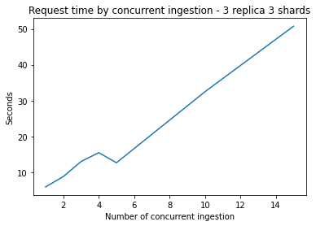

# Part 1 - Design

### 1. Explain your choice of types of data to be supported and technologies for **mysimbdp-coredms**.

The chosen data is [COVID-19 cases worldwide](https://data.europa.eu/euodp/en/data/dataset/covid-19-coronavirus-data/resource/260bbbde-2316-40eb-aec3-7cd7bfc2f590), 
which contains the cummulative number for 14 days of COVID-19 cases per 100000 people. The data structure is as follow:

- *dateRep*: the date of record.
- *day, month, year*: the time detail of record.
- *cases*: the total number of cases.
- *deaths*: the total number deaths.
- *countriesAndTerritories*: the country name.
- *geoId*: 2-digit abbreviation of the country name.
- *countryterritoryCode*: 3-digit abbreviation of the country name.
- *popData2019*: the total population in 2019.
- *continentExp*: the continent that the country belongs to.
- *Cumulative_number_for_14_days_of_COVID-19_cases_per_100000*

The data can be aggregated by continent or country to analyse and compare statistics. Furthermore, time series data can be retrieved to
predict number of cases in the future with machine learning models. I chose MongoDB to represent **mysimbdp-coredms** due to its ability
to fully scale both vertically or horizontally. MongoDB also stored records as documents compressed in JSON files, which is suitable for
complex structured or unstructured data. Finally, it is easy to deploy with great user experience for developers.

### 2. Design and explain interactions between main components in the architecture of **mysimbdp**.

<p align="center">

<p>

The diagram above illustrates the architecture of **mysimbdp**. Components will be described as follows:
- *Consumer/Producer*: This component represents (one or many) producers/consumers run by tenants that interact with the **mysimbdp** to
work with the database. Both store and read processes will go through the API as long as the database is available.
- *mysimbdp-coredms*: A MongoDB Atlas instance that stores and manages data.
- *mysimbdp-daas*: A REST API built with Flask on Python defines a set of protocols that enable interactions with consumers/producers.
The API receives requests and connect to *mysimbdp-coredms* with library *pymongo*.
- *mysimbdp-dataingest*: This component read data from data sources (files/external databases/messaging systems) and then store the data
to *mysimbdp-coredms* with library *pymongo*.

Let us dive deeper into interactions between main components in the architecture:
- From *Consumer/Producer* to *mysimbdp-daas*: The interaction is demonstrated in the python script *code/from_consumer-producer_to_daas.py*.
Consumer/Producer can store data to the database, clear the database, or find records with a specific date or country.
- From *mysimbdp-daas* to *mysimbdp-coredms*: With library *pymongo*, operations such as insert, delete are quite straightforward.
Moreover, the API ensures that data retrieved from the database will be compressed in JSON format.
- From *mysimbdp* to *mysimbdp-coredms*: This connection allow storing the external data sources directly to the database by using module
*pymongo*, which is an API of MongoDB.

### 3. Explain a configuration of a cluster of nodes for mysimbdp-coredms so as to prevent a single-point-of-failure problem for mysimbdp-coredms for the tenants .

To avoid a single-point-of-failure problem, it is important to have a replica set. Replication are basically multiple copies of data 
on different database or servers, which supplies redundancy and high availability. It is recommended to have at least three nodes to 
obtain the benefits of a replica set. By defailt, MongoDB have one primary nodes that confirms any write request and two secondary nodes
that receive replications. Secondary replica set are asynchronous, meaning one can still work properly despite the failure of the others.
In case the primary nodes does not communicate with the others for a certain amount of time, a secondary node tries to nominate itself as
the primary through an election, which will temporarily halt all write operations until it finishes. If there occurs network errors or no
healthy primary node exists, we can allow MongoDB to automatically retry certain write operations. Last but not least, we can configure
MongoDB to revert write operations when a member rejoins the replica set after a failover to maintain database consistency.

### 4. Explain how many nodes are needed in the deployment of **mysimbdp-coredms** for your choice so that this component can work property.
As explained above, a replica set should have at least three nodes. Additional nodes might increase redundacy and availability 
but also increase latency. For this assignment, we will use default setting of MongoDB: one primary and  two secondary nodes 
for simple implementation.

### 5. Explain how would you scale mysimbdp to allow many tenants using mysimbdp-dataingest to push data into **mysimbdp**.
We can exploit sharding to support intensive write operations, as the workload will be distributed accress the shards. In certain situations,
we can group data from multiple tenants and ingest them to the database in batch. Adding a load balancer is also a good idea to make sure
the workload is equally distributed.

# Part 2 - Implementation

### 1. Design and explain one example of the data schema/structure for a tenant whose data will be stored into *mysimbdp-coredms*.
The *mysimbdp-coredms* is a MongoDB Atlas instance that store data in the form of JSON documents. The dataset is in csv format so ingested
data are well-structured colunar table, which is quite straightforward when being compressed into JSON format. The data structure can be
inspected more closely in part 1. An example document in our covid collection is in the following form:

	{
		"_id": {
			"$oid": "620f1e9e5a82be1d4803d4eb"
		},
		"dateRep": "14/12/2020",
		"day": 14,
		"month": 12, 
		"year": 2020,
		"cases": 360,
		"deaths": 0,
		"countriesAndTerritories": "Finland",
		"geoId": "FI",
		"countryterritoryCode": "FIN",
		"popData2019": 5517919.0,
		"continentExp": "Europe",
		"Cumulative_number_for_14_days_of_COVID-19_cases_per_100000": 112.01686723
	}
	
### 2. Given the data schema/structure of the tenant (Part 2, Point 1), design a strategy for data partitioning/sharding and explain your implementation for data partitioning/sharding together with your design for replication in Part 1, Point 4, in *mysimbdpcoredms*
I design a strategy called hashed sharding with the key value is the row number. The method is quite simple: row ```n``` will be ingested
into shard ```n % n_shards```. Since MongoDB requires paid clusters to use sharding feature, I decided to simulate the process in 
*mysimbdp-dataingest* by creating three different collections, each represents a shard. Together with three replica set members, we 
will have totally 12 shards if resources are available. To deploy the platform with different number of shards, we can create additional
collections.

### 3. Assume that you are the tenant, write a mysimbdp-dataingest that takes data from your selected sources and stores the data into mysimbdp-coredms. Explain possible consistency options for writing data in your mysimdbp-dataingest
The *mysimbdp-ingest* is implemented by reading the data locally and ingesting directly into the database using MongoDB APIs, so called
*pymongo*. As mentioned above, MongoDB only accept write operations through the primary node. After that, replication are sent to secondary
nodes. Eventually the platform would remain consistent in terms of different nodes.

### 4. Show the performance (response time and failure) of the tests for 1,5, 10, .., n of concurrent mysimbdp-dataingest writing data into mysimbdp-coredms.
<p align="center">

<p>

### 5. Observing the performance and failure problems when you push a lot of data into mysimbdp-coredms (you do not need to worry about duplicated data in mysimbdp), propose the change of your deployment to avoid such problems (or explain why you do not have any problem with your deployment)
The requests fail when I tried to run 20 concurrent ingestions. The space quota is not enough, meaning that we need more database storage.
Also, the query time are really slow and seems to linearly increase with the number of concurrence. To speed up the ingestion process,
I propose to use such streaming processing tools as Apache Kafka to replace the pymongo APIs. In reality, we might need the platform to
work with tons of covid data coming from each test center everyday. A highly scalable streaming platform like Kafka will ensure to
ingest such high volume of data.

# Part 3 - Extension
### 1. Using your mysimdbp-coredms, a single tenant can create many different databases/datasets. Assume that you want to support the tenant to manage metadata about the databases/datasets, what would be your solution?
We can support the tenant by having a collection where we store the metadata of each dataset. Indeed, we can build a component that
save neccessary metadata when the tenants work with the API (through the Python script) or with directly the database (through *mysimbdp-dataingest*).

### 2. Assume that each of your tenants/users will need a dedicated mysimbdp-coredms. Design the data schema of service information for mysimbdp-coredms that can be published into an existing registry (like ZooKeeper, consul or etcd) so that you can find information about which mysimbdp-coredms is for which tenants/users
We will add the registry service like ZooKeeper on top of multiple *mysimbdp-coredms* (belongs to multiple tenants). The zookeeper will keep
information about tenants (e.g. tenant_id) and databases (e.g. database_name) together. Whenever we extract data of a database, we know exactly
who is the tenant.

### 3. Explain how you would change the implementation of mysimbdp-dataingest (in Part 2) to integrate a service discovery feature
In this case, we can use ZooKeeper to keep information about services, devices and add a service discovery protocols that connect with ZooKeeper.
Otherwise, we can use Apache Kafka for *mysimbdp-dataingest* and Kafka has its own service discovery feature.

### 4. Assume that now only mysimbdp-daas can read and write data into mysimbdp-coredms, how would you change your mysimbdp-dataingest (in Part 2) to work with mysimbdp-daas? 
In this case, the *mysimbdp-dataingest* would make requests to the API instead of calling MongoDB APIs. We can now, in some cases, treat 
*mysimbdp-dataingest* as a consumer/producer.

### 5. Assume that you design APIs for mysimbdp-daas so that any other developer who wants to implement mysimbdpdataingest can write his/her own ingestion program to write the data into mysimbdp-coredms by calling mysimbdp-daas. Explain how would you control the data volume and speed in writing and reading operations for a tenant?
We can use authentication to control the data volume. By creating multiple database with different configurations, we can enable developers to
pay as they write the data. The more their demmand, the more money they have to pay, the more powerful database we will supply. When we have
different kind of clients like that, we can also set up quotas for writing, so that clients with more data will have more space.