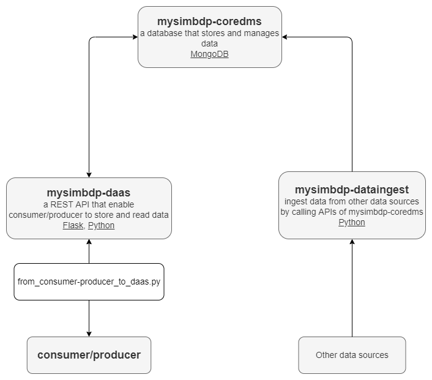

# Part 1 - Design

### 1. Explain your choice of types of data to be supported and technologies for **mysimbdp-coredms**.

The chosen data is [COVID-19 cases worldwide](https://data.europa.eu/euodp/en/data/dataset/covid-19-coronavirus-data/resource/260bbbde-2316-40eb-aec3-7cd7bfc2f590), 
which contains the cummulative number for 14 days of COVID-19 cases per 100000 people. The data structure is as follow:

- *dateRep*: the date of record.
- *day, month, year*: the time detail of record.
- *cases*: the total number of cases.
- *deaths*: the total number deaths.
- *countriesAndTerritories*: the country name.
- *geoId*: 2-digit abbreviation of the country name.
- *countryterritoryCode*: 3-digit abbreviation of the country name.
- *popData2019*: the total population in 2019.
- *continentExp*: the continent that the country belongs to.
- *Cumulative_number_for_14_days_of_COVID-19_cases_per_100000*

The data can be aggregated by continent or country to analyse and compare statistics. Furthermore, time series data can be retrieved to
predict number of cases in the future with machine learning models. I chose MongoDB to represent **mysimbdp-coredms** due to its ability
to fully scale both vertically or horizontally. MongoDB also stored records as documents compressed in JSON files, which is suitable for
complex structured or unstructured data. Finally, it is easy to deploy with great user experience for developers.

### 2. Design and explain interactions between main components in the architecture of **mysimbdp**.

The diagram above illustrates the architecture of **mysimbdp**. Components will be described as follows:
- *Consumer/Producer*: This component represents (one or many) producers/consumers run by tenants that interact with the **mysimbdp** to
work with the database. Both store and read processes will go through the API as long as the database is available.
- *mysimbdp-coredms*: A MongoDB Atlas instance that stores and manages data.
- *mysimbdp-daas*: A REST API built with Flask on Python defines a set of protocols that enable interactions with consumers/producers.
The API receives requests and connect to *mysimbdp-coredms* with library *pymongo*.
- *mysimbdp-dataingest*: This component read data from data sources (files/external databases/messaging systems) and then store the data
to *mysimbdp-coredms* with library *pymongo*.

Let us dive deeper into interactions between main components in the architecture:
- From *Consumer/Producer* to *mysimbdp-daas*: The interaction is demonstrated in the python script *code/from_consumer-producer_to_daas.py*.
Consumer/Producer can store data to the database, clear the database, or find records with a specific date or country.
- From *mysimbdp-daas* to *mysimbdp-coredms*: With library *pymongo*, operations such as insert, delete are quite straightforward.
Moreover, the API ensures that data retrieved from the database will be compressed in JSON format.
- From *mysimbdp* to *mysimbdp-coredms*: This connection allow storing the external data sources directly to the database by using module
*pymongo*, which is an API of MongoDB.

### 3. Explain a configuration of a cluster of nodes for mysimbdp-coredms so as to prevent a single-point-of-failure problem for mysimbdp-coredms for the tenants .

To avoid a single-point-of-failure problem, it is important to have a replica set. Replication are basically multiple copies of data 
on different database or servers, which supplies redundancy and high availability. It is recommended to have at least three nodes to 
obtain the benefits of a replica set. By defailt, MongoDB have one primary nodes that confirms any write request and two secondary nodes
that receive replications. Secondary replica set are asynchronous, meaning one can still work properly despite the failure of the others.
In case the primary nodes does not communicate with the others for a certain amount of time, a secondary node tries to nominate itself as
the primary through an election, which will temporarily halt all write operations until it finishes. If there occurs network errors or no
healthy primary node exists, we can allow MongoDB to automatically retry certain write operations. Last but not least, we can configure
MongoDB to revert write operations when a member rejoins the replica set after a failover to maintain database consistency.

### 4. Explain how many nodes are needed in the deployment of mysimbdp-coredms for your choice so that this component can work property.
As explained above, a replica set should have at least three nodes. Additional nodes might increase redundacy and availability 
but also increase latency. For this assignment, we will use default setting of MongoDB: one primary and  two secondary nodes 
for simple implementation.

### 5. Explain how would you scale mysimbdp to allow many tenants using mysimbdp-dataingest to push data into mysimbdp.
We can exploit sharding to support intensive write operations, as the workload will be distributed accress the shards. In certain situations,
we can group data from multiple tenants as batches and ingest to the database by batch.

